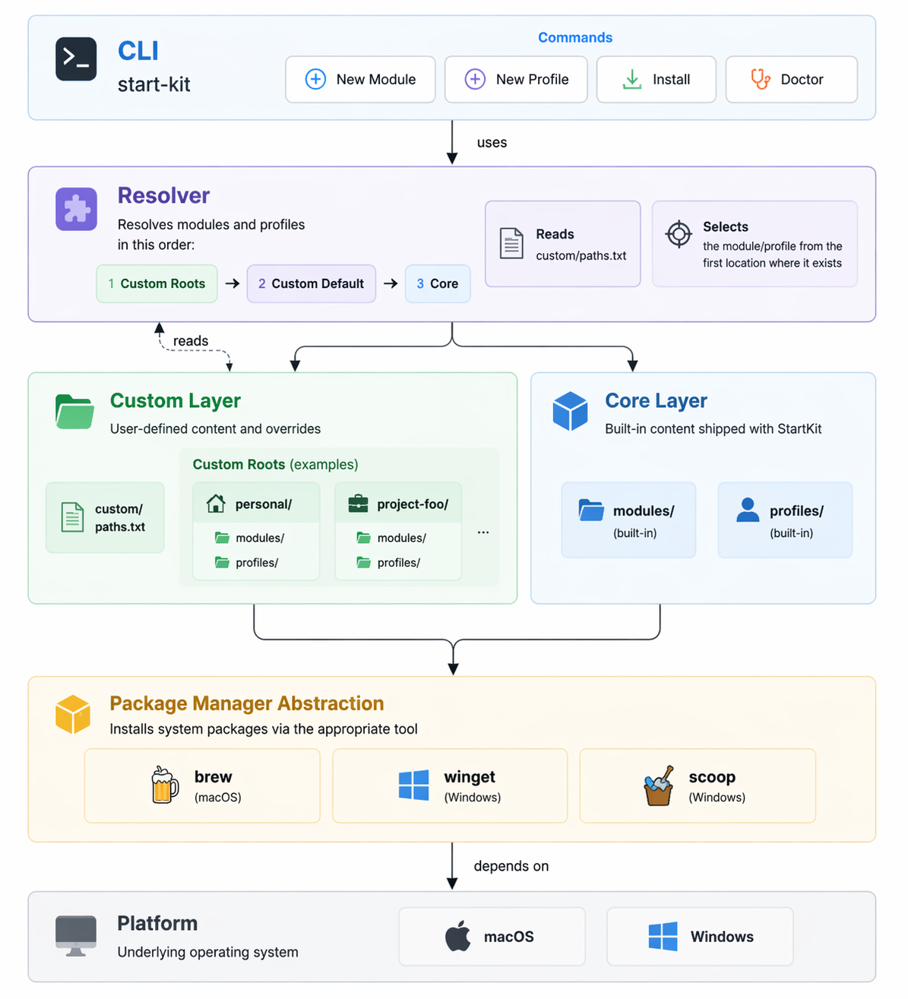

# StartKit

[](./README.md)
[](./README.ja.md)

> 🇺🇸 English: [README.md](./README.md)

**macOS / Windows 向けの、組み立て可能な開発環境セットアップCLIです。**

StartKit は、次の要素で開発環境を構築するための modular CLI framework です。

- **module**: 1ツール = 1module
- **profile**: 用途単位のmodule集合
- **custom**: OSS本体を汚さないローカル拡張

<details>
<summary>目次</summary>

- [🚀 1分で試す](#-1分で試す)
- [✨ なぜ StartKit か](#-なぜ-startkit-か)
- [🧩 特徴](#-特徴)
- [🏗 アーキテクチャ](#-アーキテクチャ)
- [🧠 コア概念](#-コア概念)
- [Framework, not Distribution](#framework-not-distribution)
- [🖥 サポートプラットフォーム](#-サポートプラットフォーム)
- [📦 start-kit-extras](#-start-kit-extras)
- [📖 CLI](#-cli)
- [📄 Contract](#-contract)
- [⚠️ uninstall ポリシー](#-uninstall-ポリシー)
- [🤝 Contributing](#-contributing)
- [📜 ライセンス](#-ライセンス)

</details>

## 🚀 1分で試す

1分で StartKit を体験できます。

```bash
git clone <repo>
cd start-kit

export PATH="$PWD/bin:$PATH"

start-kit install profile base
```

確認:

```bash
git --version
start-kit doctor
```

> **`git` についての補足**
>
> StartKit は `git clone` で取得することが多いですが、これはあくまで一例です。
> zip 配布など、他の方法でも導入できます。
>
> `git` module は、StartKit 自体の取得に必須だから含めているのではなく、
>
> - 多くの環境で利用される実用的な base ツールであること
> - cross-platform な package manager abstraction の reference implementation であること
>
> という理由で core に含めています。
>
> つまり、「StartKit の取得方法」と「StartKit が管理する対象」は意図的に分離されています。

## ✨ なぜ StartKit か

多くのセットアップリポジトリは、特定の個人・マシン・チームに強く依存しています。

StartKit はそこを分離します。

- core は小さく保つ
- ツールは独立した module にする
- profile で用途ごとに束ねる
- `custom/` でローカル差分を持てる
- 危険な uninstall 抽象化はしない

そのため StartKit は、

- 個人用セットアップ基盤
- チーム導入の土台
- 他者が拡張できる OSS

として使えます。

## 🧩 特徴

- モジュールベース設計
- profile による用途別構成
- 冪等実行
- `custom/` によるローカル拡張
- `doctor` による動作確認
- module / profile 雛形生成
- macOS / Windows を前提にした cross-platform 構造
- 依存解決時の確認 UX
- `--yes` / `--dry-run` 対応
- 意図的に最小化した core

## 🏗 アーキテクチャ



```text
            +----------------------+
            |      start-kit       |
            |        (CLI)         |
            +----------+-----------+
                       |
        +--------------+--------------+
        |                             |
+-------v--------+           +--------v--------+
|    profile     |           |      module     |
| (use-case set) |           | (tool unit)     |
+-------+--------+           +--------+--------+
        |                             |
        |                     +-------v--------+
        |                     | package mgr    |
        |                     | abstraction    |
        |                     +-------+--------+
        |                             |
        |                     +-------v--------+
        |                     |   platform     |
        |                     | macOS/windows  |
        |                     +----------------+
```

## 🧠 コア概念

### module
1ツール単位の定義です。

### profile
用途単位で module をまとめたものです。

### custom
ローカル専用の拡張領域です。

```text
custom/modules/
custom/profiles/
```

## Framework, not Distribution

StartKit は、**ツール配布セットではなく、環境構築フレームワーク**です。

このリポジトリの主な価値は、次の基盤部分にあります。

- CLI
- module / profile contract
- runner / doctor
- platform / package manager abstraction
- `custom/` によるローカル拡張

そのため、StartKit 本体には **最小限の reference modules / profiles のみ** を同梱します。

### 本体に置く reference modules

- `example`
- `git`
- `homebrew`
- `winget`
- `scoop`

### 本体に置く reference profiles

- `base`
- `macos-bootstrap`
- `windows-bootstrap`

これらは仕組みを示すための基準実装であり、  
「全員に推奨する公式ツールセット」を意味するものではありません。

> StartKit は distribution ではなく framework です。

## 🖥 サポートプラットフォーム

StartKit は現在、次をサポート対象とします。

- macOS
  - Homebrew
- Windows
  - winget
  - scoop

Linux は現時点ではスコープ外ですが、将来的な拡張余地は設計上残しています。

## 📦 start-kit-extras

StartKit core は意図的に最小構成にしています。

次のような実用的ツールセットが必要なら、

- エディタ系
- AI開発ツール
- GUIアプリ

**`start-kit-extras`** またはローカルの `custom/` を使う前提です。

`start-kit-extras` は、StartKit の上に載る実用 module collection です。

## 📖 CLI

```bash
start-kit install module <name> [--version <value>] [--yes] [--dry-run]
start-kit install profile <name> [--yes] [--dry-run]

start-kit doctor
start-kit doctor module <name>
start-kit doctor profile <name>

start-kit list modules
start-kit list profiles

start-kit new module <name>
start-kit new profile <name>

start-kit version
start-kit --version
start-kit -v

start-kit help
```

## 📄 Contract

### module contract

```bash
MODULE_NAME=""
MODULE_DESCRIPTION=""
MODULE_DEPENDS=()
MODULE_MANUAL_DOCS=()
MODULE_SUPPORTS_VERSION=false
MODULE_SUPPORTED_PLATFORMS=("macos" "windows")

MODULE_PACKAGE_BREW=""
MODULE_PACKAGE_WINGET=""
MODULE_PACKAGE_SCOOP=""

check()
plan()
install()
post_install()
doctor()
```

### profile contract

```bash
PROFILE_NAME=""
PROFILE_DESCRIPTION=""
PROFILE_MODULES=()
OPTIONAL_MODULES=()
```

## ⚠️ uninstall ポリシー

StartKit は統一的な uninstall 機構を提供しません。

module 側で `uninstall()` を持つことはできますが、v1 の CLI からは呼びません。

## 🤝 Contributing

以下を参照してください。

- [CONTRIBUTING.md](`CONTRIBUTING.md`)
- [docs/cli-spec.md](`docs/cli-spec.md`)
- [docs/module-spec.md](`docs/module-spec.md`)
- [docs/profile-spec.md](`docs/profile-spec.md`)
- [docs/platform-design.md](`docs/platform-design.md`)
- [docs/repo-split-policy.ja.md](`docs/repo-split-policy.ja.md`)
- [docs/git-workflow.md](`docs/git-workflow.md`)
- [changeset-guide.md](`docs/changeset-guide.md`)
- [changeset-release-flow.md](`docs/changeset-release-flow.md`)

## 変更履歴

リリース履歴は [CHANGELOG.md](./CHANGELOG.md) を参照してください。

## 📜 ライセンス

MIT
